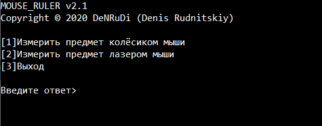

# MOUSE_RULERv2

Вторая версия по превращению компьютерной мыши в линейку! 

Ознакомиться с первой версией Вы можете по ссылке:
https://github.com/DeNRuDi/MOUSE_RULER

# UPDATE

Во второй версии была добавлена возможность измерять предмет посредством лазера мыши, а так же были исправлены некоторые недочеты первой версии. Подробнее читайте в описании.

# УСТАНОВКА и ПРЕДОСТЕРЕЖЕНИЯ:
ВАЖНО! Установите на строке 17 ваше разрешение экрана! В следующей версии v2.1 этого делать не нужно будет! 

По умолчанию установлено значение - (1920,1080)

`value = Values(1920,1080)`

Чтобы воспользоваться программой, Вам стоит скачать библиотеки pynput и pyautogui:

`pip install pynput`

`pip install pyautogui` 

# ПОГРЕШНОСТЬ
Имейте ввиду! 2 способ (измерение сенсором/лазером) имеет намного меньшую точность по сравнению с 1 способом (измерение колесиком мыши). 

Измерение зависит от количетва DPI (количество точек на дюйм) вашей мыши! 
Погрешность 2 способа измерения: +- 2 см, а так же есть вероятность большей погрешности после 1м измерения!

(Протестировано на Windows 10, Python 3.7.6, MOUSE - Genius GM-090005)
